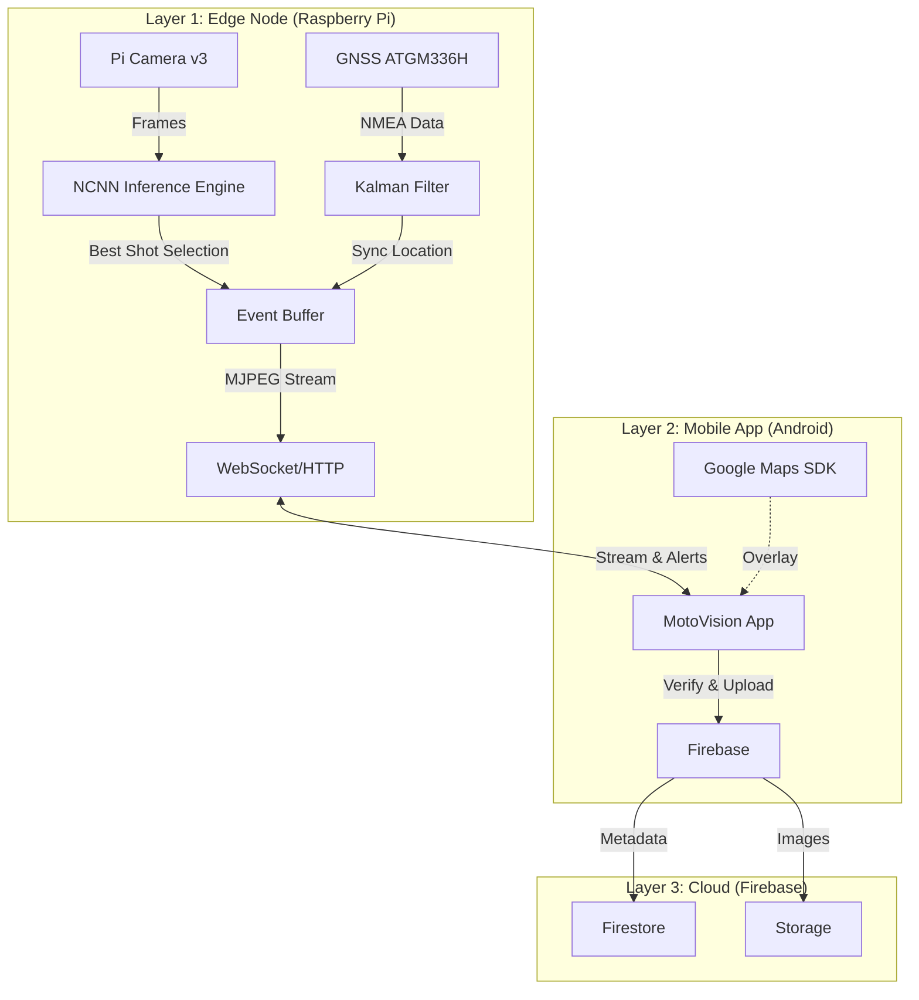

# 🏍️ MotoVision: Edge-based Pothole Detection & Reporting System

MotoVision is an end-to-end AIoT solution designed to detect potholes in real-time, log their geospatial location, and facilitate community-driven road maintenance reporting[^1].

Using a lightweight Instance Segmentation model running on the edge (Raspberry Pi), the system identifies road damages and syncs verified data to the cloud via a companion Android Application.

---

## 📖 Table of Contents

- [🔭 Overview](#-overview)
- [🏗 System Architecture](#-system-architecture)
- [🌟 Key Features](#-key-features)
- [⚙ Hardware Requirements](#-hardware-requirements)
- [💻 Tech Stack](#-tech-stack)
- [📂 Directory Structure](#-directory-structure)
- [🚀 Installation & Setup](#-installation--setup)
- [📊 Results & Performance](#-results--performance)
- [👥 Team & Acknowledgments](#-team--acknowledgments)

---

## 🔭 Overview

Road maintenance in developing countries often suffers from delayed reporting and manual inspection costs[^2]. MotoVision solves this by automating the detection process.

The system captures road imagery, processes it locally using **YOLOv8n-seg optimized with NCNN**, coordinates with **GNSS** for precise location, and allows users to verify and upload incidents via a mobile app[^3].

---

## 🏗 System Architecture

The project follows a decoupled **Edge–Mobile–Cloud** architecture[^4]:


---
## 🌟 Key Features
🧠 Edge Intelligence (Raspberry Pi)

Instance Segmentation: Uses YOLOv8n-seg to detect pothole boundaries and estimate severity based on pixel area1
.

NCNN Optimization: Optimized for ARM CPUs, achieving functional framerates without a discrete GPU2
.

Smart Tracking (SORT): Prevents duplicate logs for the same pothole using IoU-based tracking3
.

"Best Shot" Logic: Automatically selects the clearest, centered frame of a pothole to save as evidence4
.

GNSS Smoothing: Implements Kalman Filter + interpolation to sync 30fps video with 1Hz GPS data5
.

📱 Mobile Application (Android)

Split-Screen Interface: Live MJPEG stream (top) + Google Maps navigation (bottom)6
.

Human-in-the-loop Verification: User confirms detections before upload to reduce false positives7
.

Real-time Alerts: WebSocket notifications on pothole detection8
.

⚙ Hardware Requirements

Based on the Bill of Materials:
| Component | Specification | Function |
| :--- | :--- | :--- |
| **SBC** | Raspberry Pi 4 Model B (4GB) | Main processing unit |
| **Camera** | Pi Camera Module v3 | Image acquisition (CSI) |
| **GNSS** | ATGM336H (GPS+BDS) | Geospatial localization (UART) |
| **Storage** | MicroSD Card (64GB Class 10) | OS and local dataset storage |
| **Power** | 5V/3A Power Supply | Stable power for Pi & peripherals |

💻 Tech Stack

Edge (Raspberry Pi):

Python 3.9+

NCNN (Tencent)

OpenCV

SQLite (local logging)10

Mobile (Android):

Kotlin / Java

Google Maps SDK

MPAndroidChart (optional)

Cloud:

Firebase Firestore (metadata)

Firebase Storage (evidence images)

## 📂 Directory Structure
```text
MotoVision-Project/
├── android_app/                # Android Studio Project
│   ├── app/
│   │   ├── src/                # Java/Kotlin source code
│   │   └── google-services.json # (Ignored) Firebase Configuration
│   ├── local.properties        # (Ignored) Maps API Key
│   └── build.gradle.kts        # Build configuration
├── raspberry_pi/               # Edge Device Source Code
│   ├── ncnn_model/             # Quantized YOLOv8 models
│   ├── main_app_updated.py     # Main execution script
│   ├── sort.py                 # Tracking algorithm
│   ├── serviceAccountKey.json  # (Ignored) Firebase Admin Key
│   └── requirements.txt        # Python dependencies
└── docs/                       # Documentation & Project Reports
```
🚀 Installation & Setup
### Part 1: Raspberry Pi (Edge)
1. **Clone repository:**
\`\`\`bash
git clone https://github.com/tranngocanhtoan-afk/MotoVision.git
cd MotoVision/raspberry_pi
\`\`\`

2. **Install dependencies:**
\`\`\`bash
pip install -r requirements.txt
\`\`\`

Requires opencv-python, ncnn, pyserial, firebase-admin

Setup secrets:

Put serviceAccountKey.json inside raspberry_pi/ (git-ignored).

Run:

python main_app_updated.py

Part 2: Android App

Open android_app/ in Android Studio

Create local.properties:

MAPS_API_KEY=AIzaSyDxxxxxxxxx_Your_Key


Download google-services.json from Firebase Console and place it in android_app/app/

Build & Run

📊 Results & Performance

Dataset: Trained on 2,254 images (augmented) collected from Vietnamese roads11
.

Accuracy: mAP@50 (Mask) = 0.726, outperforming bbox-only approaches12
.

Speed: ~4 FPS on Raspberry Pi 4 CPU using NCNN13
. The buffering "Best Shot" logic helps avoid missing critical events at city speeds14
.

👥 Team & Acknowledgments

Project Course: MotoVision - Vietnamese-German University (VGU)15

Instructor: Dr. Vo Bich Hien16

Student Team:

Nguyen Gia Thong (10422117)

Le Ba Thai Quan (10421102)

Tran Ngoc Anh Toan (10422118)

References:

YOLOv8 by Ultralytics

NCNN by Tencent
